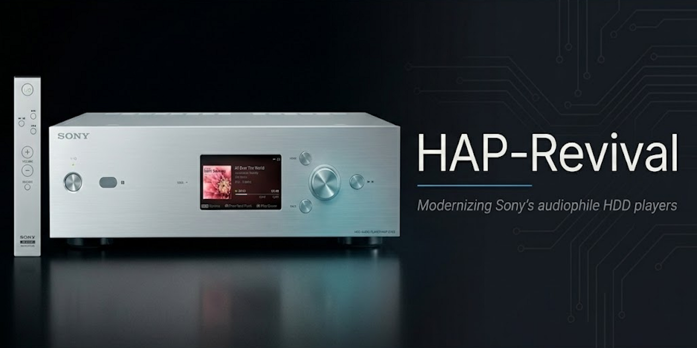

<p align="center">
  
</p>

# HAP-Revival

> **Modernizing the Sony HAP-Z1ES and HAP-S1 audiophile HDD players.**
> Sony stopped shipping software in January 2021. We're picking it up.

<p align="left">
  
  
  
  
</p>

---

## Why this project exists

The Sony HAP-Z1ES (released 2014, list price ~€2000) is an audiophile-grade HDD music player built around a serious analog chain: dual Burr-Brown **PCM1795** DACs in mono mode, an **Analog Devices SHARC** DSP, a custom **FPGA**, and a clean linear power supply. Sony's "ES" line still represents some of the best mass-produced source hardware of the decade.

Sony shipped the last firmware (**19404R**) in January 2021 and walked away. Five years later, the device:

- Still uses **SMBv1** by default for file transfers (broken on modern macOS, requires disabling Windows security defaults).
- Streams Spotify **only in standard resolution** — on a machine designed for hi-res audio.
- Has **no Tidal, no Qobuz, no Roon, no AirPlay 2**, no service added after 2016.
- Runs an iOS app ("HDD Audio Remote") that hasn't been updated since 2022, looks like 2014, and may be removed from the App Store at any moment.
- Boots a **Linux 3.0.35 kernel** with userland from the OpenWrt era.

The hardware deserves better. **HAP-Revival** is the open project to give it better.

## Status

**Pre-alpha. Research and reverse-engineering phase.**

We are currently:

- ✅ Mapping the network API surface (ports 60100/60200, ScalarWebAPI methods, MusicConnect UPnP service).
- ✅ Documenting the internal hardware stack from Sony's published GPL sources, service manuals, and community teardowns.
- ✅ Cataloging every public prior-art artefact so contributors don't re-do work.
- ⏳ Decompiling the `com.sony.HAP.HDDAudioRemote` Android APK to recover the full API method dictionary.
- ⏳ Probing the UART debug port on the main board for a root shell.
- ⏳ Format-analyzing the 19404R firmware blob.

**Nothing in this repository will brick your device** at the current stage. All reconnaissance is network-passive and read-only.

## Supported devices

| Device | Status | Notes |
|---|---|---|
| Sony **HAP-Z1ES** | Primary target | Source player only, no internal amplifier; clean analog output |
| Sony **HAP-S1** | Secondary target | Same SoC and software stack, adds integrated amplifier (2× LM3876 + NJW1194 volume) |

The two devices share the same i.MX6 SoC, same firmware images, same network protocols, and the same `oss.sony.net` GPL source release. Work on one transfers to the other.

## What works today

| Capability | Status | Notes |
|---|---|---|
| SSDP discovery of HAP devices on the LAN | ✅ | `tools/discover.py` |
| Reading "now playing" state via JSON-RPC | ✅ | `avContent.getPlayingContentInfo` v1.2 |
| Reading system info, volume, sound settings | ✅ | See [api-method-catalog](research/api-method-catalog.md) |
| Pause / next / previous controls | ✅ | Per [frazei gist (2022)](https://gist.github.com/frazei/09d69242a8beed0cf0a1c193a45a650a) |
| Browsing the music library via API | ⚠️ | Partial — `getContentList` parameter shape still being mapped |
| Modern streaming (Tidal, Qobuz, Spotify Hi-Res, Roon) | ❌ | Requires custom userland |
| Modern iOS / iPad / Android control app | ❌ | Planned once API is fully mapped |
| Custom OS replacement | ❌ | Long-term goal; requires UART access + firmware unpack first |

## Roadmap

**Phase 1 — Reverse engineering (no risk to the device).**
Decompile the official APK, format-analyze the firmware blob, capture iOS app traffic in Wireshark, read Sony's GPL kernel patches and the `forza_snd_driver` source. *Current phase.*

**Phase 2 — Third-party control app.**
Modern web / iOS / iPad app talking to the *existing* ScalarWebAPI on port 60200. No firmware modification. Useful immediately for any HAP owner.

**Phase 3 — Root shell.**
UART probe or hidden-menu exploit to obtain a shell on the device. Snapshot the rootfs as a safety net. Re-enable the Dropbear SSH binary that already ships in firmware.

**Phase 4 — Custom userland.**
Keep Sony's kernel + `forza_snd_driver` (preserves the audio chain), replace the proprietary playback daemon with MPD + modern streaming bridges (librespot, mopidy, squeezelite). Requires a tested recovery path.

**Phase 5 — Fully modern OS, modern app, new services.**
Mainline kernel where feasible, new control plane, multi-device fleet management, the iOS app talking to our own API instead of Sony's.

## Architecture (target end state)

```
       ┌────────────────────────────────────┐
       │  iOS / iPad / Android / Web client │
       │  (modern UI, hi-res streaming UX)  │
       └─────────────────┬──────────────────┘
                         │ HTTPS + WebSocket
       ┌─────────────────▼──────────────────┐
       │  HAP-Revival control daemon        │
       │  (Python / FastAPI on the device)  │
       └─────────────────┬──────────────────┘
                         │
       ┌─────────────────▼──────────────────┐
       │  Sony's kernel 3.0.35 + forza_snd  │
       │  (preserved — drives FPGA + DSP)   │
       └─────────────────┬──────────────────┘
                         │ I²S
       ┌─────────────────▼──────────────────┐
       │  Sony FPGA → SHARC DSP → 2×PCM1795 │
       │  (the part that makes it audiophile│
       │   — untouched, no excuses)         │
       └────────────────────────────────────┘
```

## Documentation

The full research lives in [`docs/`](docs/). Recommended reading order:

1. [Overview](docs/00-overview.md) — the project in one page
2. [Hardware](docs/01-hardware.md) — SoC, FPGA, DSP, DAC, ports
3. [Software stack](docs/02-software-stack.md) — OS, daemons, libraries
4. [Network API](docs/03-network-api.md) — ScalarWebAPI on port 60200
5. [SMB share](docs/04-smb.md) — file transfer protocol
6. [Diagnostic modes](docs/05-diag-modes.md) — DIAG + Special Mode entry sequences
7. [HDD swap recipe](docs/06-hdd-swap.md) — SSD compatibility, cloning
8. [Firmware](docs/07-firmware.md) — blob, GPL sources, partitions
9. [Prior art bibliography](docs/08-prior-art.md) — every existing artefact, ranked

Active reconnaissance work lives in [`research/`](research/). Tools and scripts in [`tools/`](tools/). Living API spec in [`api-spec/`](api-spec/).

## Getting started (contributors)

You need a HAP-Z1ES or HAP-S1 on the same LAN, Python 3.10+, and ~10 minutes.

```bash
git clone https://github.com/Guillain-RDCDE/HAP-Revival.git
cd HAP-Revival
python tools/discover.py
```

This will SSDP-probe your network, identify any HAP devices, and dump their full UPnP description + a sample of API responses. **No write operations.** Output is saved to `research/captures/` for triage.

To go further: read [CONTRIBUTING](CONTRIBUTING.md).

## Non-goals

- **Not a streaming service.** No music hosting, no DRM, no accounts.
- **Not selling hardware.** We help you keep yours alive longer.
- **Not bricking your device.** Anything destructive will be gated behind explicit, documented opt-in.
- **Not replacing the analog chain.** The Sony FPGA → SHARC → PCM1795 path is the point of owning this hardware. We preserve it.

## Disclaimer

The HAP-Z1ES is out of warranty in 2026 regardless of what you do to it. That said: opening the case, probing UART, or eventually flashing custom firmware *can* damage your device. Anything in this repository is provided as-is, with no warranty. **You are responsible for your own hardware.** Read the documentation, take backups, ask questions before acting.

## License

- **Code** (anything under `tools/`, `api-spec/examples/`, future daemon code): [MIT](LICENSE).
- **Documentation** (anything under `docs/`, `research/`, README, etc.): [Creative Commons Attribution-ShareAlike 4.0](LICENSE-docs).

Choose this split so the code is maximally reusable (including by future iOS apps that might be commercial), while ensuring the painstakingly-collected documentation always remains open and credited.

## Acknowledgements

- **Sony Engineering** — for shipping outstanding hardware in 2014 and publishing the GPL source bundle that makes this work possible.
- **[danielrweber/HAPxFer](https://github.com/danielrweber/HAPxFer)** — the only third-party HAP project on GitHub before us, and a working reference for the SMB protocol.
- **[frazei](https://gist.github.com/frazei/09d69242a8beed0cf0a1c193a45a650a)** — for the first public documentation of the JSON-RPC control surface (July 2022).
- **[rytilahti/python-songpal](https://github.com/rytilahti/python-songpal)** — protocol-cousin reference implementation we'll port from.
- **The Japanese audiophile community** (emuzu, briareos, saionjihouse, kakaku.com regulars) — for years of hands-on HDD swap and modification documentation that nobody in the English-speaking world has matched.
- **You**, if you contribute — see [CONTRIBUTING](CONTRIBUTING.md).
