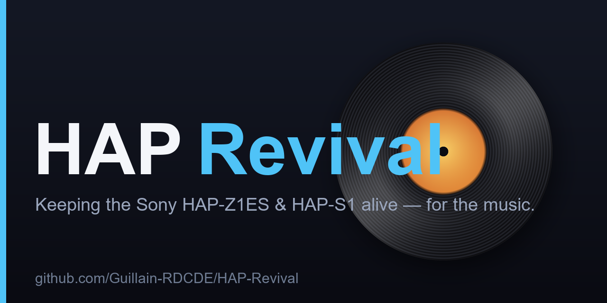
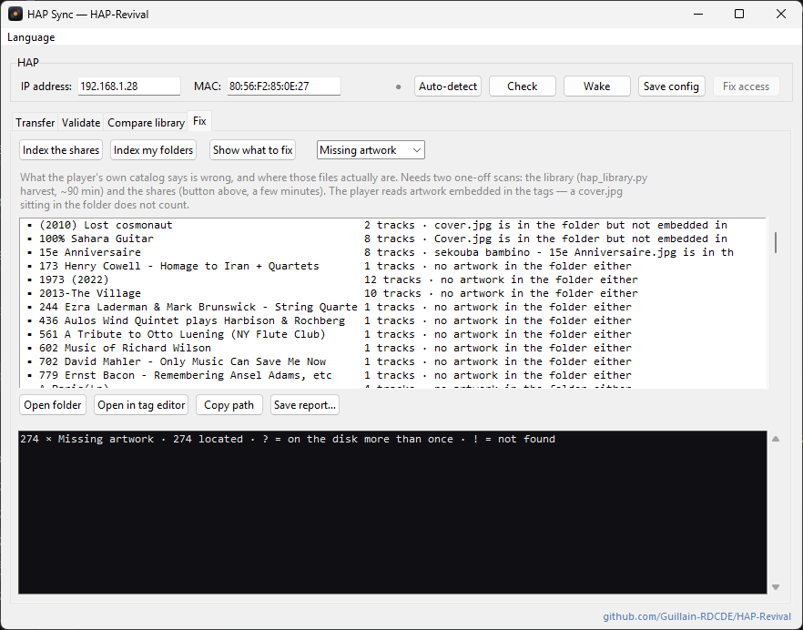
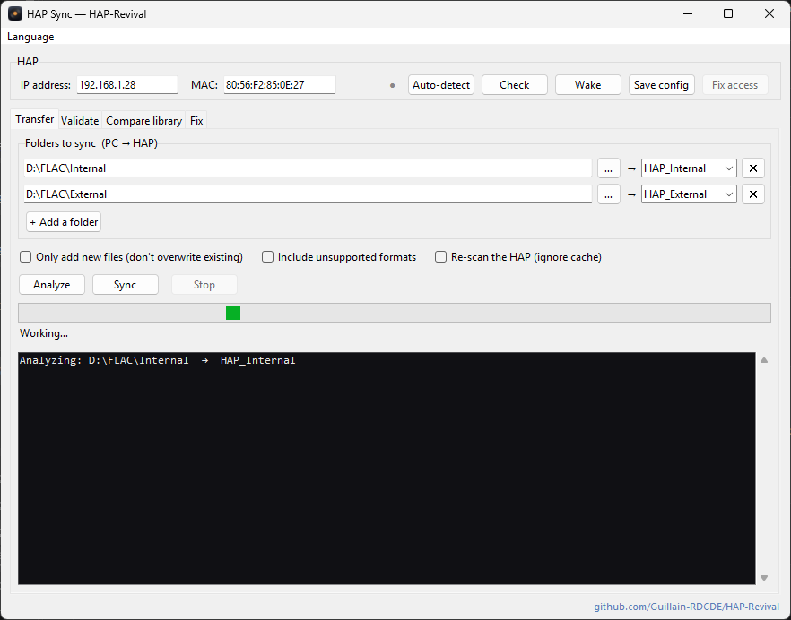

<!-- markdownlint-disable MD033 MD041 -->
<div align="center">



<br><br>

**Open software for the Sony HAP-Z1ES and HAP-S1.**

Sony shipped a 2014 audiophile masterpiece, then stopped writing software for it in January 2021.
The hardware still sings. This is the rest of the story.

<br>

[](https://github.com/Guillain-RDCDE/HAP-Revival/releases/latest)
&nbsp;
[](tests)
&nbsp;
[](LICENSE)

[**Download HAP Sync**](https://github.com/Guillain-RDCDE/HAP-Revival/releases/latest) &nbsp;·&nbsp;
[I own a HAP](#own-a-hap-start-here) &nbsp;·&nbsp;
[How it works](#under-the-hood) &nbsp;·&nbsp;
[Documentation](docs/00-overview.md)

</div>

<br>

---

<br>

## Own a HAP? Start here

Five things your player can do again. Each one works today, over your own network, with nothing
sent anywhere. **Nothing here can damage the device**: reads are pure, playback is bounded, and
standby asks first.

<br>

### 1. Get music onto it, without fighting Windows

Sony's only supported route is an SMBv1 share. Modern Windows and macOS resist it, and when it
half-works it drops files without saying so.

[**HAP Sync**](https://github.com/Guillain-RDCDE/HAP-Revival/releases/latest) speaks the protocol
itself, so your operating system keeps its defences up. Point it at a folder, press Sync. It finds
the player, wakes it if asleep, transfers only what changed, and skips the junk that becomes ghost
tracks. Libraries stuck for years transfer cleanly.

> Double-click `HapSync.exe`. No Python, no account, no configuration file to edit.

<br>

### 2. Control it from your phone

```bash
python tools/webui.py <hap-ip>        # then open http://localhost:8080
```

Now-playing with cover art, transport, seek, the sound settings, six languages, light and dark.
Updates arrive the instant the music changes, because the player pushes them.

On an iPhone: Safari → Share → **Add to Home Screen** gives a standalone remote with its own icon.
No App Store. [How to install it](docs/13-control-app.md).

<br>

### 3. Play internet radio, which Sony took away

It was never broken. Sony removed it from the mobile app and from the front-panel menus — not from
the machine.

```bash
python tools/hap_client.py <hap-ip> radio-browse root
python tools/hap_client.py <hap-ip> play-station --uri <uri>
```

It took this project five days and three published-then-retracted theories to discover we were
sending one HTTP header too many. [The whole story](docs/16-gotchas.md#6-never-send-x-hap-device-id-on-a-netservice-browse).

<br>

### 4. Browse and search your whole library, from the remote

The player's own library API answers over the network — artists, albums, tracks with codec and
sample rate, one tap to play. Search is accent-insensitive, so `dvorak` finds `Dvořák`.

This is the half Sony's app lost. It is in the web remote above, and on the command line:

```bash
python tools/hap_library.py <hap-ip> album-tracks 10633
python tools/hap_library.py <hap-ip> search dvorak
```

<br>

### 5. See what is wrong with your collection — and fix it

```bash
python tools/library_audit.py --from-player <hap-ip>
```

An audiophile health check: how much of your library is genuinely hi-res versus CD versus lossy,
DSD and at what rates, PCM above the player's 192 kHz ceiling, albums showing a blank tile for want
of artwork, duplicated tracks.

Then [**Fix**](tools/hap_fixit.py) tells you **where each of those albums actually is** — and opens
it in Explorer or a tag editor. If the album is also on your own disk, it opens *your* copy, so the
edit is instant and your next sync carries it to the player.

<div align="center">
<br>

<br><br>

</div>

<br>

---

<br>

## Install

**Windows, no Python.** Download [`HapSync.exe`](https://github.com/Guillain-RDCDE/HAP-Revival/releases/latest),
put it anywhere, double-click it. On first launch SmartScreen asks — *More info*, then *Run anyway*.
It isn't code-signed yet.

**Everything else.** Python 3.10 or newer:

```bash
git clone https://github.com/Guillain-RDCDE/HAP-Revival.git
cd HAP-Revival

python tools/discover.py                          # find the HAP on your network
python tools/webui.py <hap-ip>                    # browser remote, on port 8080
python tools/hap_client.py <hap-ip> now-playing   # or the command line

python tools/webui.py --demo                      # no HAP? drive the mock device instead
```

Only the SMB tools need a dependency — `pip install pysmb`. Everything else is standard library.
To build the `.exe` yourself, run `tools/build_gui.ps1` in a clean virtual environment.

**No player yet?** [`mock_hap.py`](tools/mock_hap.py) impersonates one faithfully — a living demo
library, generated cover art, working transport, the REST catalogue, and the front panel with its
keys. The remote, the client, the library tools and the screen tool all run against it; only the
live smoke test needs real hardware, since checking a real player is the entire point of it.

<br>

---

<br>

## Under the hood

*The rest of this page is for people who want to know how, and why it is trustworthy.*

<br>

### What the machine is

Dual Burr-Brown PCM1795 DACs, an Analog Devices SHARC DSP, a custom FPGA on the clock domain, an
isolated linear supply, fourteen kilos of chassis — and, underneath, an i.MX6 running **Linux
3.0.35** with Samba 3.0.37. A decade on it still measures and sounds superb. The software is what
rotted: SMBv1 transfers, standard-resolution Spotify on a hi-res deck, nothing added since 2016.

The analog chain — FPGA → SHARC → PCM1795 — is the entire point of this hardware. **Every phase of
this project leaves it untouched.**

<br>

### Three APIs on one port

Port 60200 serves three distinct interfaces. The third exists in no public documentation.

| Interface | Shape | What it gives |
|---|---|---|
| **ScalarWebAPI** | JSON-RPC | Transport, now-playing, sound settings, internet radio. ~30 methods validated live, with a [machine-readable spec](api-spec/) |
| **REST** `/sony/contentplayer` + `/sony/contentdb` | REST | Power, transport, and **the whole music catalogue** — artists, albums, tracks, codecs, artwork |
| **`/sony/hap`** | Query-string GET | **The front panel as a PNG, and its buttons injectable.** Found only in two "out of support" pages the player still serves |

Plus a **UDP push channel**: the player announces state changes instead of needing to be polled.

Full map: [`docs/03-network-api.md`](docs/03-network-api.md). The first two came out of a
[teardown of Crestron's 2016 control module](research/notes/2026-08-20-crestron-module-teardown.md);
the third came from a contributor noticing two file names.

<br>

### What has been established

Nothing published so far has opened a case or touched firmware. The writes made are the ordinary
ones a remote control makes.

- **The front panel is mirrorable and scriptable over HTTP.** Fetch the 480×272 display as a PNG,
  press its keys: `python tools/hap_screen.py <ip> show`
  ([write-up](research/notes/2026-08-27-hap-tool-endpoint.md)). Everything Sony left in the
  on-device menus is reachable from the network — no firmware, no UART, no NAND.
- **The library API was never dead** — the finding that reshaped the project. It answers fine; it
  is simply slow, and every tool here had a six-second timeout
  ([measurements](research/notes/2026-08-29-contentdb-was-never-dead.md)).
- **Internet radio works, and always did.**
- Sony's `HDDAudioRemote` Android app is decompiled — the first public decompile of this client.
- The internal disk is read. It holds no operating system: a SQLite catalogue and your music, with
  the full schema in hand.
- The hardware is identified from the metal up, including both DSPs and the kernel driver's ioctl
  surface.
- Sony's update host is alive and is a plain HTTP file server, so the firmware image may be
  downloadable rather than needing a NAND dump ([`docs/07-firmware.md`](docs/07-firmware.md)).

<br>

### The traps

This is a 2014 embedded box with a 2014 HTTP stack, and it punishes several habits that are correct
everywhere else. [**`docs/16-gotchas.md`**](docs/16-gotchas.md) is nine of them, each a case where
the generally right move is the locally wrong one:

- Setting `Content-Type` on a JSON POST from a browser **breaks the request**.
- Issuing requests concurrently poisons unrelated endpoints — the daemon serialises.
- A short HTTP timeout reads as a dead API. Cold library requests took **5 to 57 seconds** here —
  and that figure is a property of the catalogue's size, not of the device, so it is a floor, not a
  number. Double the deadline on retry rather than picking a ceiling.
- Response bodies are **not uniformly UTF-8**: one artist name in 17 317 arrived as raw Latin-1
  inside otherwise valid UTF-8, and `json.loads` lost the whole 343 KB page over one character.
- Reusing one SMB connection across two long listings silently returned **5 931 files instead of
  66 733**, with no error at all.

If you are writing a client for this player, read that page before you write anything else.

<br>

### How this project works

Measure, publish, and correct in public. Six conclusions published here have since been overturned
— five by a contributor who owns the hardware, one by our own testing — and each correction is
written up next to the claim it replaces rather than quietly edited away.

The most expensive of them: a "dead" API that was merely slow, believed for months because every
tool gave up after six seconds. The lesson generalised in
[gotcha 7](docs/16-gotchas.md#7-never-keep-a-short-http-timeout): *a failure that always arrives at
the value you chose is evidence about your client, not about the device.*

300 tests, stdlib-only, run against a mock device on every push, plus a live smoke test that
asserts real values from a real player — because green unit tests once passed against a client that
read nothing at all.

<br>

### Roadmap

Five phases: reverse engineering → a modern control app over the existing API → a root shell → a
custom userland keeping Sony's kernel and audio driver → a modern OS. **Risk to the device stays at
none until phase three**, and the custom userland waits behind a tested recovery path.

<br>

---

<br>

## Devices

**HAP-Z1ES.** The primary target. A pure source player with clean analog out and no internal amp.

**HAP-S1.** The smaller sibling, with an integrated amp. Same SoC, same firmware images, same
protocols — work on one transfers to the other.

<br>

## The tools

Nineteen of them. Stdlib-only Python, no accounts, no telemetry.

<details>
<summary>Full list</summary>

<br>

### Move music onto the player

- [**HAP Sync**](tools/hap_gui.py) — copies your music to the HAP in one click. Start here.
- [**HAP Sync CLI**](tools/hap_sync.py) — the same transfer engine, scriptable.
- [**SMB Doctor**](tools/smb_doctor.py) — repairs the Windows settings that updates keep breaking.
- [**Companion**](tools/hap_companion.py) — pre-flight validation and a library diff for any copy tool.

### Control the player

- [**Web UI**](tools/webui.py) — now playing, transport, sound settings, library browse and search.
- [**Control app**](docs/13-control-app.md) — the same UI on your phone's home screen.
- [**Python client**](tools/hap_client.py) — every mapped API method, including internet radio.
- [**Front panel**](tools/hap_screen.py) — mirror the display, press its keys, over HTTP.
- [**Push notifications**](tools/hap_notify.py) — the player says when something changes.
- [**Discovery**](tools/discover.py) — finds the HAP on your network.

### Understand and repair your library

- [**Library over REST**](tools/hap_library.py) — the whole catalogue from a running player.
- [**Library audit**](tools/library_audit.py) — formats, hi-res share, duplicates, missing artwork.
- [**Fix it**](tools/hap_fixit.py) — every finding with the real folder it is in, ready to open.
- [**Library browser**](tools/library_browser.py) — reads the on-disk catalogue offline.

### Research and quality

- [**Mock device**](tools/mock_hap.py) — a fake HAP that answers the real protocol.
- [**Live smoke test**](tools/smoke_live.py) — checks the client against your own player.
- [**Interceptor**](tools/hap_intercept.py) — logs what names the player looks up.
- [**API fuzzer**](tools/api-fuzzer.py) and [**call**](tools/call.py) — probe the API by hand.
- [**Link checker**](tools/check_links.py) — every relative link and heading anchor. Runs in CI.

</details>

<br>

## Documentation

New here? [**Start Here**](docs/START-HERE.md). The project in one page:
[**Overview**](docs/00-overview.md). **Own a HAP and want to help?**
[**Help in five minutes**](docs/HELP-IN-5-MINUTES.md) — read-only, copy-paste, no Python needed.

<details>
<summary>Full index — hardware, API, disk, firmware, UART, audio path</summary>

<br>

| | | | |
|---|---|---|---|
| [Hardware](docs/01-hardware.md) | [Software stack](docs/02-software-stack.md) | [Network API](docs/03-network-api.md) | [SMB share](docs/04-smb.md) |
| [Diag modes](docs/05-diag-modes.md) | [HDD swap](docs/06-hdd-swap.md) | [Firmware](docs/07-firmware.md) | [Prior art](docs/08-prior-art.md) |
| [Disk layout](docs/09-disk-layout.md) | [UART console](docs/10-uart-console.md) | [Audio path](docs/11-audio-path.md) | [Music sync](docs/12-music-sync.md) |
| [Control app](docs/13-control-app.md) | [NAND extraction](docs/14-nand-extract.md) | [Forza ioctl](docs/15-forza-ioctl.md) | [**Gotchas**](docs/16-gotchas.md) |

Reconnaissance notes live in [`research/`](research/), the tools in [`tools/`](tools/), the API
specification in [`api-spec/`](api-spec/).

</details>

<br>

## Contributing

The single most useful thing you can do is **run one command against your own player and paste what
it prints**. Every significant finding here came from that, not from deeper analysis in isolation —
including one from a contributor who simply noticed two file names.

[**Help in five minutes**](docs/HELP-IN-5-MINUTES.md) has read-only commands that need no Python.
[`CONTRIBUTING.md`](.github/CONTRIBUTING.md) says which machine can answer which question — an
HAP-S1, an older firmware and a second region's TuneIn tree all answer things a HAP-Z1ES cannot.

Corrections are as welcome as findings. Several claims on these pages were wrong until somebody who
owned the hardware said so.

<br>

## License

Code is [MIT](LICENSE). Documentation and research notes are
[CC BY 4.0](LICENSE-docs). Not affiliated with Sony.

<br>

## Acknowledgements

**Amos**, who in one week contributed the Crestron module, measurements from a HAP-S1 this project
does not own, a firmware version nobody had recorded, and the two file names that led to the front
panel API. **Saschko**, for a second region's TuneIn tree. And the HAP owners on the Steve Hoffman
forums whose posts made several of these threads findable at all.
