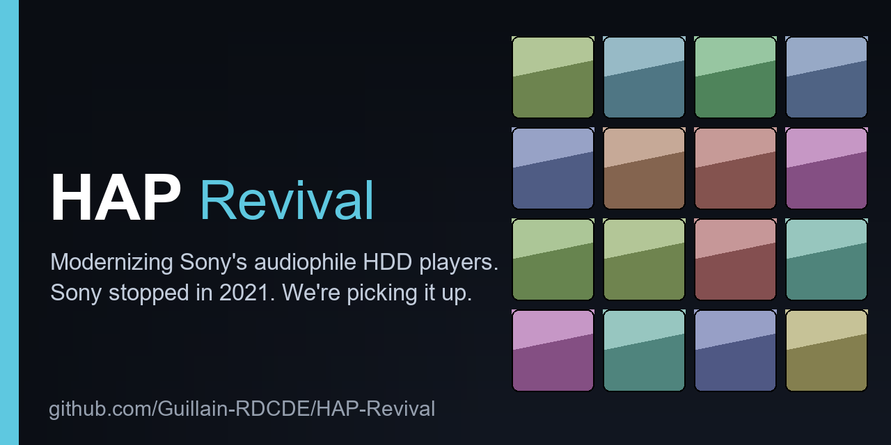

<!-- markdownlint-disable MD033 MD041 -->
<p align="center">
  
</p>

# HAP-Revival

> **Keeping the Sony HAP-Z1ES and HAP-S1 alive — for the music, not the plumbing.**
> Sony shipped its last firmware in January 2021. We're picking it up from there.

<p align="left">
  
  
  
  
</p>
<!-- markdownlint-enable MD033 MD041 -->

> 🟢 **New here, or not a programmer? [Start with the friendly guide → `docs/START-HERE.md`](docs/START-HERE.md)**
>
> It explains what this machine is, what you can do *today*, and how deep you want to go — in five plain-language minutes, no jargon. The rest of this README is the technical side.

---

## Downloads — software you can use today

HAP-Revival is rebuilding the software Sony walked away from, one usable piece at a time. As each replacement is ready, it shows up here.

| Software | What it does | Platform | Status |
|---|---|---|---|
| **🎵 HAP Sync** | Copy your music to the HAP in one click — auto-finds the device, remembers your folders, skips what the HAP can't use | Windows | ✅ Beta — [**⬇ download `.exe`**](https://github.com/Guillain-RDCDE/HAP-Revival/releases/latest/download/HapSync.exe) |
| **🌐 Web UI** | Browser remote: now-playing, play / pause / seek, sound settings, cover art | Any browser | ✅ Usable today |
| **📱 Control app** | The web UI, **installed to your iPhone/iPad home screen** — own icon, full-screen, no App Store | iOS · iPadOS · Android | ✅ Usable today — [install guide](docs/13-control-app.md) |
| **📟 Python client / CLI** | Scriptable control of every mapped API method | Any OS | ✅ Usable today |
| Custom firmware / userland | Modern OS with hi-res streaming (Tidal · Qobuz · Roon) + AirPlay | On-device | ⏳ Planned |
| Native iOS / iPad app | A modern remote to replace Sony's abandoned one | iOS / iPadOS | ⏳ Planned (the home-screen web app above is the bridge) |

### 🎵 HAP Sync — getting your music onto the HAP, finally painless


**[⬇ Download HapSync.exe](https://github.com/Guillain-RDCDE/HAP-Revival/releases/latest/download/HapSync.exe)** — one self-contained file, no install. (First launch: Windows SmartScreen → *More info → Run anyway*, the binary isn't code-signed yet.)

Sony's only supported transfer path is an **SMBv1** share that modern Windows and macOS fight you over. **HAP Sync** is a tiny native Windows app that does it properly:

- **Auto-detects the HAP** on your network — no IP address to hunt down (it scans for the device and reads its details straight off the API).
- **Speaks SMB1 directly** — you never have to enable Windows' insecure SMB1 client.
- **Two folders, both shares**: feed the internal disk and a USB drive from two PC folders — and your folders are **remembered between runs**, so you set them once.
- **Skips the junk** (`Thumbs.db`, `.DS_Store`, FreeFileSync `.ffs_tmp`, AppleDouble `._*`) that the HAP would otherwise index as **ghost tracks** polluting your library.
- **Skips formats the HAP can't play**, and flags PCM above its 192 kHz ceiling.
- **Incremental & fast**: only new or changed files are sent, and the remote file index is cached — so repeat syncs are near-instant instead of a multi-minute re-scan.
- **Wake-on-LAN** to wake a sleeping HAP, a **live progress** view, and the HAP auto-reindexes new files within seconds.
- **Built-in SMB doctor**: *Check* diagnoses access in one click (the transfer itself never needs Windows' SMB settings). And because Windows updates keep re-breaking File Explorer / Sony's HAP Music Transfer against the HAP's ancient SMBv1 server, a **Fix Windows access** button repairs the exact culprits — the new SMB-signing requirement, insecure-guest blocking, the SMB1 client feature, and stale mapped drives — with one UAC prompt. Background: [docs/04-smb.md](docs/04-smb.md).

```powershell
# Run from source (Python 3.10+)
pip install pysmb
python tools/hap_gui.py

# …or build a standalone, double-click HapSync.exe (no Python needed to run it)
powershell -ExecutionPolicy Bypass -File tools/build_gui.ps1
```

Prefer the command line, or scripting it into a schedule? The same engine ships as a CLI — see [`tools/hap_sync.py`](tools/hap_sync.py) and the [music-sync guide](docs/12-music-sync.md). The GUI is new (beta); the underlying transfer engine is live-tested end-to-end.

---

## Why we're doing this

Put a 24/96 FLAC on a HAP-Z1ES, sit down, and the room changes. There's a stillness around the instruments. A cymbal decays longer than it has any right to. Cellos have weight; voices have a body; you can hear the space the recording was made in. This is what audiophile-grade source hardware is *supposed* to do — and what €500 streamers, however clever, still don't.

The HAP-Z1ES (2014, ~€2000 at launch) does it with a chain Sony's "ES" engineers clearly built to last: dual Burr-Brown **PCM1795** DACs in mono mode, an Analog Devices **ADSP-21488 SHARC** DSP (with a Cirrus **CS48L10** alongside it), a custom Sony **FPGA** running the clock domain, a properly isolated linear PSU, a 14 kg chassis built like a piece of furniture. A decade on it still measures and sounds outstanding.

What didn't last is the software.

Sony shipped firmware **19404R** in January 2021 and quietly walked away. Five years later, the machine that does Mahler so well:

- still uses **SMBv1** for file transfers (broken on modern macOS, off by default on Windows),
- streams Spotify **only in standard resolution** — on a deck designed for hi-res,
- has **no Tidal, no Qobuz, no Roon, no AirPlay 2**, nothing added after 2016,
- runs an iOS remote ("HDD Audio Remote") that hasn't been touched since 2022 and may vanish from the App Store any day,
- boots a **Linux 3.0.35 kernel** with userland from the OpenWrt era.

The hardware deserves better. **HAP-Revival** is the open project to give it better — software worthy of the analog chain Sony built, written by people who actually listen on these things.

> *A personal note — I bought a HAP-Z1ES years ago because it sounded right, and it still does. Watching Sony abandon software this good felt like watching a beautiful instrument get locked in a cupboard. This repo is the lockpick. — Guillain*

## Status

**Pre-alpha. Research and reverse-engineering phase — and unapologetically a music project pretending to be a software project.**

Where we are:

- ✅ Mapped the network API surface (ports 60100/60200, ScalarWebAPI methods, MusicConnect UPnP).
- ✅ Documented the internal stack from Sony's GPL sources, service manuals, and community teardowns.
- ✅ Catalogued every public prior-art artefact so contributors don't redo work.
- ✅ Decompiled the `com.sony.HAP.HDDAudioRemote` Android APK (first public decompile of this client) and live-validated ~30 API methods from it.
- ✅ Shipped a small Python client library + a browser-based web UI you can use *today*.
- ✅ Read the internal disk directly: it holds **no OS** — only a SQLite catalog (`/data`) + your music (`/mnt/internal/storage/…`). The full library DB and its schema are now in hand. See [disk layout](docs/09-disk-layout.md).
- ✅ Established the OS lives on internal **NAND**, and that firmware 19404R is **OTA-only with no public copy anywhere** — so the OS must be dumped from the device, not downloaded.
- ⏳ Heading for the **UART console** (identified: i.MX6 UART1, `ttymxc0 @ 115200`, balls M1/M3) to get a root shell and dump the rootfs (`/dev/mtdblock2`, JFFS2). See [UART console](docs/10-uart-console.md).

**Nothing in this repository will brick your device** at the current stage. Everything is network-passive and read-only — and even the playback control is bounded (the standby button asks before it presses anything).

## Supported devices

| Device | Status | Notes |
|---|---|---|
| Sony **HAP-Z1ES** | Primary target | Pure source player, no internal amp, clean analog out |
| Sony **HAP-S1** | Secondary target | Same SoC and stack, adds integrated amp (2× LM3876 + NJW1194 volume) |

Same i.MX6 SoC, same firmware images, same network protocols, same GPL bundle. Work on one transfers to the other.

## What works today

| Capability | Status | Notes |
|---|---|---|
| SSDP discovery of HAP devices on the LAN | ✅ | `tools/discover.py` — finds your HAP without you typing an IP |
| **Python client library** (typed dataclasses, importable) | ✅ | `tools/hap_client.py` — stdlib only, ~30 methods exposed |
| **Web UI control surface** (browser-based, single page) | ✅ | `tools/webui.py` — see [Try it now](#try-it-now-5-minutes-zero-risk) below |
| Now-playing (title / artist / codec / position / cover / RGB hint) | ✅ | `avContent.getPlayingContentInfo` v1.2 |
| Play / pause toggle, seek, next, previous, standby | ✅ | `pausePlayingContent` is a true toggle — counter-intuitive but reliable |
| Play track by ID (HDD content) | ✅ | `createPlayingListAndQuickPlay` v1.0 |
| Power: wake / wake-and-play / standby | ✅ | `setPowerStatus` with `active` / `play` / `off` / `standby` |
| System info, volume, sound settings, sleep timer, buffer time | ✅ | See [api-method-catalog](research/api-method-catalog.md) |
| DSEE / DSD-remastering / gapless / volume-normalization / oversampling | ✅ | `setSoundSettings` v1.1 round-trip validated |
| Sleep timer, buffer time, repeat, shuffle (per-source: HDD vs Spotify) | ✅ | All round-trip validated |
| Toggle favorites on tracks | ✅ | `editContentInfo` v1.0 with `tagUri:"meta:favorite"` |
| Spotify Connect detection + cover art | ✅ | Device serves HDD covers, Spotify CDN serves its own — both transparent |
| Web UI: ambient cover background, themes, adaptive contrast | ✅ | Four themes (Ambient / Solid-from-cover / Dark / Custom). Persisted. Text contrast auto-flips. |
| Web UI: Minimal mode + plain-language captions under every setting | ✅ | ⚙ panel hides chrome; each Sound/Playback option explains what it actually does in real English. |
| On-device library (SQLite) schema fully decoded | ✅ | 11 tables, ~60 PROP-codes — confirmed against the real DB read off the disk. See [DB schema](research/db-schema/) + [disk layout](docs/09-disk-layout.md) |
| Full library DB in hand | ✅ | Read directly off the HDD's `/data` partition (SQLite). The network `downloadByDiff` sync is still blocked (empty `location`) but no longer on the critical path — we have the DB |
| **Library browser** (web, reads the on-disk SQLite catalog) | ✅ | `tools/library_browser.py <hdd_browse.db>` — artists / albums / tracks / cover art / codec / sample-rate, offline. The reference decoder for the catalog schema |
| **Library audit** (offline health-check of the catalog) | ✅ | `tools/library_audit.py <hdd_browse.db>` — Hi-Res/DSD/lossless mix, format & sample-rate breakdown, PCM above the 192 kHz ceiling, albums missing cover art, likely duplicates. Text report or `--html`. Validated on a 77k-track library |
| **Music sync — GUI + CLI** (a HAP-dedicated FreeFileSync replacement) | ✅ | **`tools/hap_gui.py`** — one-click Windows app (auto-detect, remembered folders, live progress; build to `HapSync.exe` via `tools/build_gui.ps1`), sharing the **`tools/hap_sync.py`** engine: incremental SMB1 transfer to **both** `HAP_Internal` + `HAP_External` from two PC folders, auto-skips junk (`.ffs_tmp`…) and unsupported formats, preserves `<Artist>/<Album>/`, WoL + post-transfer auto-reindex. Speaks SMB1 via `pysmb`, so **no need to enable Windows SMB1**. CLI engine live-tested end-to-end; GUI is new (beta) |
| **Pre-flight checks** (validate / library diff) | ✅ | `tools/hap_companion.py` — standalone `validate` (compat / junk / >192 kHz / cover report) and `diff` against the library DB; the same filtering is built into `hap_sync` |
| **Installable control app** (PWA — add to iPhone/iPad home screen) | ✅ | `tools/webui.py` is a PWA: own icon, full-screen, standalone. See [control-app install guide](docs/13-control-app.md) |
| **Multilingual UI** (web · CLI · sync app) | ✅ | `tools/i18n.py` — every interface auto-detects your language and switches live (no reload). Ships **EN · FR · JA · DE · ES · IT**; one dict adds a language |
| **Demo mode — no hardware needed** | ✅ | `tools/mock_hap.py` is a stand-in HAP-Z1ES (living 4-track demo library, generated cover art, faithful API). `python tools/webui.py --demo` drives the web UI straight from it — perfect for screenshots and contributors without a device |
| Native iOS / iPad app | ❌ | The installable web app above works in Safari on iPhone/iPad today; native app planned |
| Modern streaming services (Tidal, Qobuz, Roon) | ❌ | Requires custom userland (Phase 4) |
| Custom OS replacement | ❌ | Long-term goal; UART root shell + NAND dump required first |

## Try it now (5 minutes, zero risk)

You need a HAP-Z1ES or HAP-S1 on your LAN, Python 3.10+, and 5 minutes.

```bash
git clone https://github.com/Guillain-RDCDE/HAP-Revival.git
cd HAP-Revival

# Find your HAP automatically via SSDP
python tools/discover.py

# CLI client
python tools/hap_client.py <hap-ip> now-playing
python tools/hap_client.py <hap-ip> system
python tools/hap_client.py <hap-ip> sound

# Or launch the web UI and open http://localhost:8080
python tools/webui.py <hap-ip>

# No HAP handy? Run everything against a built-in mock device:
python tools/webui.py --demo            # web UI on a fake HAP, zero hardware
python tools/mock_hap.py                # or run the mock standalone on :60200
python tools/hap_client.py 127.0.0.1 now-playing   # CLI against the mock
```

Every interface speaks your language: the web UI, the CLI (`--lang fr`) and the
sync app auto-detect the OS locale and ship English, French, Japanese, German,
Spanish and Italian out of the box (switch live from the ⚙ panel / Language menu).

The web UI polls every 3 seconds — slightly tighter than Sony's own 5 s cadence for snappier feedback, well within what the device handles gracefully. (The HAP has no push mechanism; polling is the only option, as confirmed from the decompiled Sony app. So we just ask politely, every three seconds.) Cover art renders inline. The accent color follows the cover's dominant hue — the HAP itself computes that RGB and exposes it via the API, a small Sony detail that's genuinely delightful once you notice it. Click the progress bar to seek. The ⚙ icon top-right opens a theme switcher with adaptive text contrast.

**Nothing in this UI can damage the device.** Reads are pure. Playback is bounded. Standby confirms before sending. The whole client is one stdlib-only file (`tools/hap_client.py`), readable in an afternoon, importable as a module or used straight as a CLI.

## Roadmap

**Phase 1 — Reverse engineering (no risk to the device).**
Decompile the official APK, read the internal disk, read Sony's GPL kernel patches and the `forza_snd_driver` source, and locate the UART console. (The 19404R firmware is OTA-only and unobtainable, so the OS will come from a NAND dump, not a blob download.) *Current phase.*

**Phase 2 — Third-party control app.**
Modern web / iOS / iPad app talking to the *existing* ScalarWebAPI on port 60200. No firmware modification. Useful immediately for any HAP owner.

**Phase 3 — Root shell.**
UART console (pinout identified) to get a shell, then `dd` the NAND (`/dev/mtdblock2`, writable JFFS2) as a safety snapshot. Re-enable the Dropbear SSH binary that already ships in firmware.

**Phase 4 — Custom userland.**
Keep Sony's kernel + `forza_snd_driver` (preserves the audio chain), replace the proprietary playback daemon with MPD + modern streaming bridges (librespot, mopidy, squeezelite). Requires a tested recovery path — we will not ship a phase 4 build before that exists.

**Phase 5 — Fully modern OS, modern app, new services.**
Mainline kernel where feasible, new control plane, multi-device fleet management, the iOS app talking to our own API instead of Sony's.

## Architecture (target end state)

```text
       ┌────────────────────────────────────┐
       │  iOS / iPad / Android / Web client │
       │  (modern UI, hi-res streaming UX)  │
       └─────────────────┬──────────────────┘
                         │ HTTPS + SSE — the HAP itself polls;
                         │              our future daemon
                         │              can finally speak push.
       ┌─────────────────▼──────────────────┐
       │  HAP-Revival control daemon        │
       │  (Python / FastAPI on the device)  │
       └─────────────────┬──────────────────┘
                         │
       ┌─────────────────▼──────────────────┐
       │  Sony's kernel 3.0.35 + forza_snd  │
       │  (preserved — drives FPGA + DSP)   │
       └─────────────────┬──────────────────┘
                         │ I²S
       ┌─────────────────▼──────────────────┐
       │  Sony FPGA → ADSP-21488 SHARC      │
       │  (+ CS48L10) → 2×PCM1795           │
       │  (the part that makes it audiophile│
       │   — untouched. This is why we're   │
       │    here in the first place.)       │
       └────────────────────────────────────┘
```

## Documentation

The full research lives in [`docs/`](docs/). Recommended reading order:

0. [**Start Here**](docs/START-HERE.md) — the friendly, no-jargon version if you're new or not a programmer
1. [Overview](docs/00-overview.md) — the project in one page
2. [Hardware](docs/01-hardware.md) — SoC, FPGA, DSP, DAC, ports
3. [Software stack](docs/02-software-stack.md) — OS, daemons, libraries
4. [Network API](docs/03-network-api.md) — ScalarWebAPI on port 60200
5. [SMB share](docs/04-smb.md) — file transfer protocol
6. [Diagnostic modes](docs/05-diag-modes.md) — DIAG + Special Mode entry sequences
7. [HDD swap recipe](docs/06-hdd-swap.md) — SSD compatibility, cloning
8. [Firmware](docs/07-firmware.md) — OTA-only blob, GPL sources, flash partitions
9. [Prior art bibliography](docs/08-prior-art.md) — every existing artefact, ranked
10. [Disk layout](docs/09-disk-layout.md) — what's actually on the HDD (no OS; SQLite catalog + music), with the full data model
11. [UART console](docs/10-uart-console.md) — serial pinout (i.MX6 M1/M3) + the path to a root shell and NAND dump
12. [Audio path](docs/11-audio-path.md) — how it makes sound: PCIe FPGA → DSPs → PCM1795, decoded from the Forza driver
13. [Music sync](docs/12-music-sync.md) — getting music onto the HAP with `hap_sync` (the FreeFileSync replacement): setup, two-share config, the cache
14. [Control app](docs/13-control-app.md) — install the web UI on your iPhone/iPad home screen as a standalone app (PWA), no App Store
15. [NAND extraction](docs/14-nand-extract.md) — the tested pipeline that turns a flash dump into a browsable rootfs (`tools/extract_rootfs.sh`)
16. [Forza ioctl reference](docs/15-forza-ioctl.md) — the decoded `/dev/forza` ioctl contract (the userspace lever for the DSP/DAC chain — the Phase-4 entry point)

Active reconnaissance lives in [`research/`](research/). Tools and scripts in [`tools/`](tools/). Living API spec in [`api-spec/`](api-spec/).

## Getting started (contributors)

You need a HAP-Z1ES or HAP-S1 on the same LAN, Python 3.10+, ~10 minutes, and ideally a record you love queued up to test against.

```bash
git clone https://github.com/Guillain-RDCDE/HAP-Revival.git
cd HAP-Revival
python tools/discover.py
```

This SSDP-probes your network, identifies any HAP devices, and dumps their full UPnP description + a sample of API responses to `research/captures/` for triage. **No write operations.**

To go further: read [CONTRIBUTING](.github/CONTRIBUTING.md). If you've unearthed a Japanese teardown blog from 2015, captured iOS traffic in Wireshark, scanned a service manual, or just have your HAP on a different network than ours, you have something to contribute. Open an issue — we read all of them.

## Non-goals

- **Not a streaming service.** No music hosting, no DRM, no accounts.
- **Not selling hardware.** We help you keep yours alive longer. That's the whole pitch.
- **Not bricking your device.** Anything destructive will be gated behind explicit, documented opt-in.
- **Not replacing the analog chain.** The Sony FPGA → SHARC (ADSP-21488) → PCM1795 path is the entire point of owning this hardware. We preserve it, period.

## Disclaimer

The HAP-Z1ES is out of warranty in 2026 regardless of what you do to it. That said: opening the case, probing UART, or eventually flashing custom firmware *can* damage your device. Everything in this repository is provided as-is, no warranty. **You are responsible for your own hardware.** Read the docs, take backups, ask before acting.

## License

- **Code** (anything under `tools/`, `api-spec/examples/`, future daemon code): [MIT](LICENSE).
- **Documentation** (anything under `docs/`, `research/`, this README, etc.): [Creative Commons Attribution-ShareAlike 4.0](LICENSE-docs).

The split keeps code maximally reusable (including by future iOS apps that might be commercial) while ensuring the painstakingly-collected documentation always remains open and credited. Knowledge about how the HAP works should never again be locked in one company's drawer.

## Acknowledgements

This project stands on a lot of shoulders.

- **Sony Engineering** — for shipping outstanding hardware in 2014 and publishing the GPL source bundle that makes this work possible. We mean it: most companies don't.
- **[danielrweber/HAPxFer](https://github.com/danielrweber/HAPxFer)** — the only third-party HAP project on GitHub before us, and a working reference for the SMB protocol.
- **[frazei](https://gist.github.com/frazei/09d69242a8beed0cf0a1c193a45a650a)** — for the first public documentation of the JSON-RPC control surface (July 2022). A single gist saved a year of work.
- **[rytilahti/python-songpal](https://github.com/rytilahti/python-songpal)** — protocol-cousin reference implementation we'll port from.
- **The Japanese audiophile community** (emuzu, briareos, saionjihouse, the kakaku.com regulars) — for a decade of hands-on HDD swap and modification documentation nobody in the English-speaking world has matched. もしこれを読んでいるなら、本当にありがとうございます。
- **You**, if you contribute — see [CONTRIBUTING](.github/CONTRIBUTING.md). Especially you if you actually *listen* on one of these.
