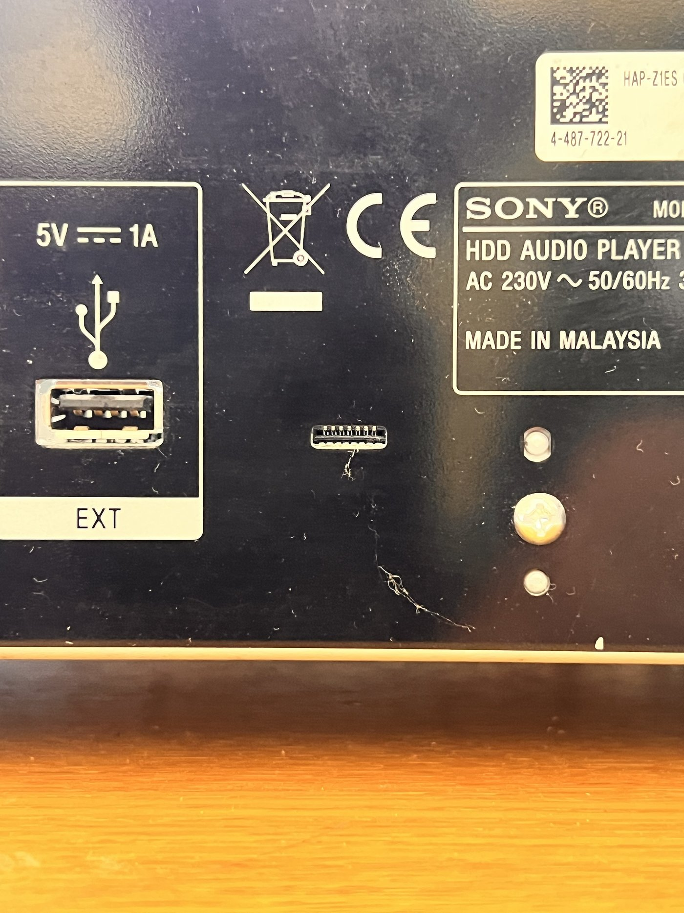
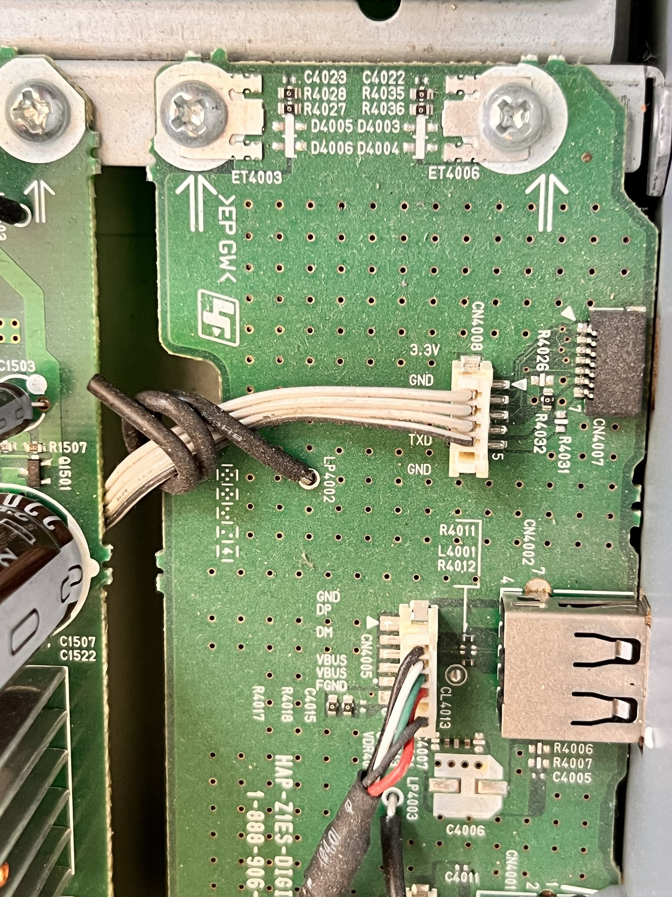
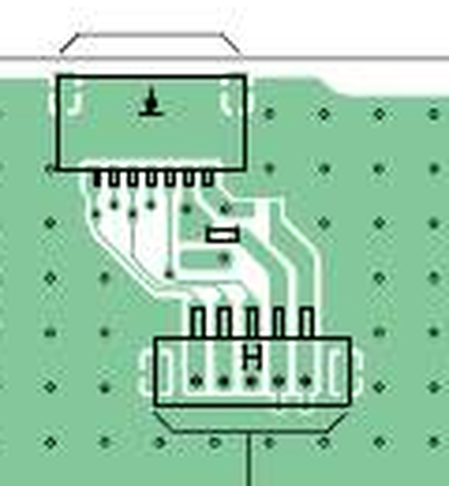
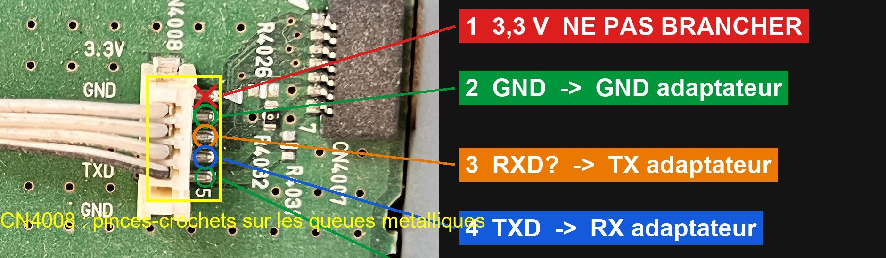

# UART serial console — getting a root shell / dumping the OS

The HAP's operating system (kernel + rootfs: the Python control daemon, the library indexer, the
proprietary GStreamer elements) lives on **internal NAND**, not the HDD (proved 2026-06-02) and is
**not downloadable** anywhere (firmware is OTA-only — see
[`research/notes/2026-06-03-os-acquisition-recon.md`](../research/notes/2026-06-03-os-acquisition-recon.md)).
The live-device software vectors (Samba symlink traversal, HTTP path traversal) are blocked. That
leaves the **UART serial console** — long flagged here as the highest-leverage hardware
opportunity — as the realistic path to a root shell and a NAND/rootfs dump.

This page is the working guide. Status (2026-09-26): **the console is located, and it is reachable
from the outside of the closed unit** through the small slot on the rear panel. Parts are on order;
no byte has been read yet.

## The short version

- The rear panel has an unlabelled slot between the `EXT` USB socket and the Sony rating label. It
  is **`CN4007`**, a 7-way flat-flex (FFC) socket, **1.0 mm pitch**, and it carries the i.MX6
  console UART (UART1, `ttymxc0`) at **3.3 V** — plus a reset line and a 3.3 V rail you must not
  touch.
- You need a **7-way 1.0 mm FFC cable**, an **FFC-to-2.54 mm breakout board** (1.0 mm side), three
  jumper wires and a **3.3 V USB–TTL adapter**. Nothing to open, nothing to solder.
- **115200 8N1**, no flow control. Open the terminal, then power the player on.

## What you need

| Item | Notes |
|---|---|
| **USB↔TTL serial adapter, 3.3 V** | CH340, CP2102, FTDI FT232RL or PL2303 — with the level jumper on **3V3**. ~3 €. |
| **FFC cable, 7-way, 1.0 mm pitch** | Any length from 10 cm; 0.3 mm thick standard. Type A or B does not matter with a breakout board. |
| **FFC-to-2.54 mm breakout board** | A ZIF (flip-latch) board takes a narrower cable than its own width, so a 9/10/12-way board is fine as long as its **1.0 mm** side is used. Get one with the pin header already soldered. |
| Female-female jumper wires | breakout → adapter |
| Multimeter | to find GND by continuity to the chassis (identifies the cable orientation) |

Verified on Amazon.fr, 2026-09-26: cable `B08493L4KZ` (20 × 150 mm, 8.72 €) and breakout
`B0D84641C2` (0.5 mm front / 1.0 mm back, right-angle header soldered, 6.88 €).

### ⚠️ Three rules that prevent frying the SoC

1. **3.3 V only.** The i.MX6 UART is 3.3 V logic. A 5 V adapter will damage the SoC.
2. **Never connect the adapter's VCC/3V3 wire.** Use only **three wires: GND, RX, TX.** The board
   is self-powered, and the service port even exposes its own 3.3 V rail — leave it alone.
3. **Cross RX↔TX:** player TX → adapter RX, player RX → adapter TX, GND ↔ GND. Swapping the two
   data lines by mistake is harmless (nothing appears; swap back).

## Serial settings

- **115200 baud, 8N1, no flow control** (i.MX6 console = `ttymxc0`; confirmed by the GPL kernel
  cmdline `console=ttymxc0,115200`).
- Windows: PuTTY or TeraTerm. macOS: the CH340 is native (`/dev/cu.usbserial-*`), `screen` or
  Python `termios` work. WSL alternative: attach the adapter via `usbipd-win`, then
  `picocom -b 115200 /dev/ttyUSB0`.

## Where the console is — traced through the service manual

Source: [`manuals/sony-service-manual-hap-z1es.pdf`](manuals/sony-service-manual-hap-z1es.pdf).
The MAIN board is codename **SPIRITOSO**; the SoC is **IC101 = MCIMX6D5EYM10AC** (i.MX6 Dual).
The board Sony calls the **IO board** (`1-888-906-11`, silk-screened `HAP-Z1ES-DIGITAL`) is the
one carrying the USB, LAN and IR sockets on the rear.

### The chain, segment by segment

| Segment | Where | Pins | Manual |
|---|---|---|---|
| SoC | IC101, MAIN board | ball **M1 = `CSI0_DAT10`** = UART1 **TX** (console out); ball **M3 = `CSI0_DAT11`** = UART1 **RX** (console in) | p47, p75 |
| Series resistors | MAIN | TX → R702 → R749 → M1; RX → R701 → M3 (all 0 Ω) | p47 |
| Main-board header | **`CN701`**, 6-way | 1 = 3.3 V, 2 = GND, 3 = **RXD** (console in), 4 = **TXD** (console out), 5 = DON, 6 = N.C. Test pads on side B: CL708 GND, CL706 TXD, CL707 RXD | p47, p40 |
| Cable | 4 white wires MAIN `CN701` → IO `CN4008` | — | — |
| IO-board header | **`CN4008`**, 5-way, 1.5 mm pitch (Sony `1-573-768-21`) | 1 = 3.3 V, 2 = GND, 3 = **RXD**, 4 = **TXD**, 5 = DON. Silk-screened `3.3V / GND / TXD / GND` next to it (the `RXD` label is under the wires). Pin 1 is unwired. | p51, p50, p110 |
| Rear service port | **`CN4007`**, 7-way FFC socket, **1.0 mm pitch**, LIF non-ZIF (Sony `1-784-859-51`) | see the table below | p51, p110 |

The names on `CN4008`/`CN701` are the **processor's**: `TXD` is what the i.MX6 transmits. The
names on the rear port `CN4007` are the **service tool's**: its `TX` pin is wired to `CN4008 RXD`
(what the player receives) and its `RX` pin to `CN4008 TXD` (what the player sends). Read from the
IO-board schematic (p51): `CL4020 TX → CN4008-3 RXD`, `CL4022 RX → CN4008-4 TXD`,
`CL4024 DON → CN4008-5 DON`. So the rear port is labelled exactly like a USB–TTL adapter, and it
wires **straight, name to name**.

### Rear service port `CN4007` — pinout and what to connect

| Pin | Name (tool side) | Test pad | Meaning for the player | Connect to |
|---|---|---|---|---|
| 1 | DON | CL4024 | goes to the SoC `DIAG_EN` input via R762 | nothing |
| 2 | RST | CL4023 | reset | **nothing** |
| 3 | RX | CL4022 | **console OUT** of the player (SoC M1) | adapter **RXD** |
| 4 | SCK | CL4021 | not connected on the IO board | nothing |
| 5 | TX | CL4020 | **console IN** of the player (SoC M3) | adapter **TXD** |
| 6 | GND | CL4019 | ground | adapter **GND** |
| 7 | 3.3 V | CL4018 | the player's 3.3 V rail | **nothing** |

Pin 1 is at the end marked by the triangle on the IO-board silk screen (the end nearest the
resistor group R4026/R4031/R4032, away from the USB socket). On the rear panel, resolve the
orientation empirically rather than by drawing: **the GND conductor is the one with continuity to
the chassis, and the 3.3 V conductor is its outer neighbour at the end of the row.** Everything
else follows from those two.

### Why 1.0 mm

The service manual gives the part but not the pitch. It was measured on the IO-board PWB drawing
(p50), which is to scale: the seven `CN4007` pads are 50 px apart where the five `CN4008` pads —
1.5 mm pitch per the parts list — are 71 px apart, i.e. **1.06 mm**, and the board's 3 mm via
grid agrees. A 7-way 1.0 mm FFC is 8.0 mm wide, which is the width of the slot on the rear panel.

### If you have the lid off anyway: `CN4008` directly

The same three signals are on `CN4008` (IO board, next to the USB socket, on the component side —
so it is reachable without unscrewing anything once the top cover is off). Its pins are 0.6 mm
tails at 1.5 mm pitch: too small for crocodile clips, fine for micro test hooks, or for sewing pins
pushed through the insulation of the white wires (top wire = pin 2). Pin 1 (3.3 V) has no wire.

| `CN4008` pin | Silk | Connect to |
|---|---|---|
| 1 | 3.3V | nothing |
| 2 | GND | adapter GND |
| 3 | (RXD) | adapter TXD |
| 4 | TXD | adapter RXD |
| 5 | GND (DON on the schematic) | nothing |

The solder-side test pads of the IO board (`CL4019` GND, `CL4022` console out, `CL4020` console
in) are the third option, mapped in
[`research/captures/2026-09-26-io-board-uart-pads.png`](../research/captures/2026-09-26-io-board-uart-pads.png)
— but the solder side faces the chassis floor, so the rear slot is the practical route.

### What is inside (board inventory, from the open unit)

Photographed 2026-09-26 on the reference HAP-Z1ES
([overview](../research/captures/2026-09-26-chassis-open-overview.jpg),
[IO board](../research/captures/2026-09-26-io-board-overview.jpg)):

| Board | Sony ref | What it is |
|---|---|---|
| MAIN (Spiritoso) | — | i.MX6 Dual IC101, 2 × H5TQ1G63EFR DDR3, KLM4G1FE3B 4 GB eMMC-class NAND (IC501), AR8035 Ethernet PHY, SATA to the HDD. Sits **under** the DSP board. |
| FPGA-DSP | `1-888-626-11` | daughter board on top of MAIN; yellow "DSP" sticker, `FORZA` marking, unpopulated CN101/CN102 pads (not a UART) |
| IO ("DIGITAL") | `1-888-906-11` | USB, LAN, IR-out; **`CN4007` service port, `CN4008` console header** |
| U-COM | — | MB9AF156 Cortex-M3 system controller (front panel, standby); talks to the i.MX6 on UART `CSI0_DAT12/13` — not the console |
| DCDC | `1-888-902-11` | digital supplies, fan control |
| ANALOG POWER | `1-888-904-11` | ±15 V / 5 V for the audio boards |
| STBY | `1-888-903-11` | **mains**: the red standby transformer and relay live here, uninsulated |
| AUDIO | `1-888-900-11` | DAC / analogue output stage |
| AUDOUT | `1-888-901-11` | RCA sockets |
| FAN-CONNECT | `1-889-634-11` | fan and HDD-bay interconnect |

Two transformers (`1-697-298-11`, `1-697-301-11`) feed the digital and analogue halves. The HDD
is an HGST 1 TB 2.5" 5400 rpm on a plain SATA cable.

The front-panel **test mode** (p25) is unrelated to the console: with the unit in standby, hold
`HOME` + `BACK`, then press `↑` then `↓` — a "Main Menu" with Version Info, ID Info, LED/KEY,
LCD/Others, HDD, Audio, WiFi, Ether, IR Learning appears on the display.

## Session plan (what we do once connected)

1. Open PuTTY at 115200 8N1, then **power on the HAP**. The **U-Boot + kernel boot log** streams —
   already a goldmine (firmware version, NAND layout, `bootargs`). If the terminal stays silent,
   swap the two data wires; if it shows garbage, try 57600 then 38400.
2. **Interrupt U-Boot**: mash a key during the "Hit any key to stop autoboot" countdown.
3. At the U-Boot prompt, read the flash layout: `mtdparts`, `nand info`, and `printenv` (the
   latter shows `bootargs`/`bootcmd` — how the rootfs is mounted).
4. **Get a root shell.** Let it boot (or type `boot`). The serial console usually lands on a root
   prompt. If it demands a login we don't have, reboot → interrupt U-Boot → append `init=/bin/sh`
   (or `single`) to `bootargs` → `boot` → a root shell with no password.
5. **Read the real flash map:** `cat /proc/mtd`, then `cat /proc/mounts`, `mount`, `df -h`.
6. **Dump each MTD partition to the PC.** Two ways — pick whichever the device supports:
   - **(A) Over Ethernet with netcat (fast).** On the PC (WSL — `nc` is already installed):
     `nc -l -p 9000 > nand_mtd2.img`. On the HAP: `dd if=/dev/mtd2 | nc <PC-IP> 9000`. Repeat per
     partition. (busybox `nc` is usually present in the rootfs.)
   - **(B) Via the SMB share we already read (no HAP-side network tools needed).** On the HAP:
     `dd if=/dev/mtd2 of=/mnt/internal/internal/mtd2.img`, then pull `mtd2.img` from the PC with any
     SMB client (e.g. `python tools/hap_sync.py list HAP_Internal`) and delete it afterwards.
   Grab at least **mtd2 (the rootfs, JFFS2)**, and ideally **every partition** for a full-NAND backup.
7. **Extract off-device:** unpack the JFFS2 with **[`tools/extract_rootfs.sh`](../tools/extract_rootfs.sh)**
   (`tools/extract_rootfs.sh mtd2.img`) → the **Python control daemon source**, init scripts, the
   library indexer, the proprietary GStreamer elements, and the DSP firmware blobs
   (`/sony/lib/modules/dspfw/`). That's the OS, in clear, with no dependence on the OTA blob.
   The full, **tested** extraction pipeline (and an important gotcha — WSL2's kernel has no MTD
   modules, so use the userspace `jefferson` path, not `mtdram`/`nandsim`) is in
   [`docs/14-nand-extract.md`](14-nand-extract.md).

## Flash layout — what the GPL kernel already tells us (pre-UART)

Read from the Sony `linux-3.0.35` kernel patch (oss.sony.net), so we walk in knowing what to expect:

- **Kernel boot cmdline** (`CONFIG_CMDLINE`): `noinitrd console=ttymxc0,115200 root=/dev/mtdblock2 rw rootfstype=jffs2 ip=off`, with `CONFIG_CMDLINE_FROM_BOOTLOADER=y`.
  - **Confirms** the console is `ttymxc0 @ 115200` (matches the M1/M3 pinout above).
  - **The rootfs is `/dev/mtdblock2`, a writable JFFS2** on NAND — not a read-only squashfs.
- **NAND**: Freescale **GPMI** controller (`gpmi-nand`).
- **SPI-NOR**: an **M25P32 (4 MB)** on SPI0/CS1, partitioned `bootloader` (offset 0, 256 KB) + `kernel` (rest).

Coherent predicted MTD map (exact map comes from U-Boot — confirm at the prompt with `cat /proc/mtd`):

| mtd | Medium | Contents |
|---|---|---|
| mtd0 | SPI-NOR | U-Boot (256 KB) |
| mtd1 | SPI-NOR | kernel (uImage) |
| **mtd2** | **NAND** | **rootfs (JFFS2)** ← the OS we want |
| mtd3+ | NAND | data / other |

**Consequences:**

- To dump the OS: `dd if=/dev/mtdblock2 of=rootfs.jffs2` (then `unmount`/extract with `jffs2dump`
  or mount via `mtdram`/`nandsim` off-device). Plus the full NAND for safety.
- The rootfs being **writable JFFS2** means once we have a shell we can **persist changes** —
  enable dropbear at boot, drop in our own daemon — which is exactly what Phase 4 (custom userland)
  needs. (Back up the NAND first.)

Also documented in the IC101 pin table (p75–79): the i.MX6 **boot-mode straps** are hardwired
(`EIM_A18/A20/A21/A23`, `EIM_RW`, `EIM_EB1`, `EIM_DA3/DA5/DA6/DA7` fixed H/L → boot from NAND), and
**JTAG** (TDO/TMS/TDI/TCK) is present but marked "Not used". The neighbouring UARTs are explicitly
tied to other blocks — `CSI0_DAT12/13` (M2/T1) to the system controller, `CSI0_DAT14/15` to the
remote-commander code-learning processor — which is what makes M1/M3 the general console.

## Safety nets

- **Read before write.** Just dumping (boot log + `dd` of NAND) changes nothing on the device.
- Do **not** `nand erase`/`nand write` anything during the dump phase.
- Keep the verified `/data` backup image (`D:\HAPZ1ES\images\p1_rootfs.img`) and don't factory-reset
  until we have a full NAND dump archived.
- The STBY board (top right when the lid is off) carries **230 V** on bare pins. Keep fingers and
  probes away from it; the console work never needs to go near it.
